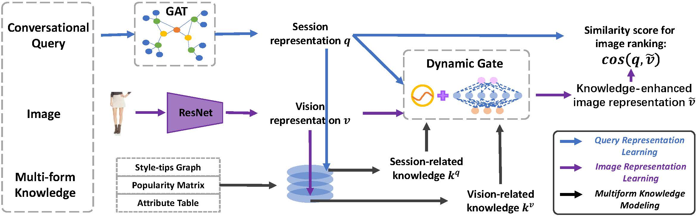

# LARCH

This is the official pytorch implementation of the paper: **Conversational Image Search.** Liqiang Nie, Fangkai Jiao, Wenjie Wang, Yinglong Wang, and Qi Tian. *TIP 2021*.



### Abstract


> Conversational image search, a revolutionary search mode, 
> is able to interactively induce the user response to clarify their intents step by step. 
> Several efforts have been dedicated to the conversation part, 
> namely automatically asking the right question at the right time for user preference elicitation, 
> while few studies focus on the image search part given the well-prepared conversational query. 
> In this paper, we work towards conversational image search, 
> which is much difficult compared to the traditional image search task,
> due to the following challenges: 1) understanding complex user intents
from a multimodal conversational query; 2) utilizing multiform
knowledge associated images from a memory network; and 3)
enhancing the image representation with distilled knowledge. 
> To address these problems, in this paper, we present a
novel contextuaL imAge seaRch sCHeme (LARCH for short),
consisting of three components. In the first component, we design
a multimodal hierarchical graph-based neural network, which
learns the conversational query embedding for better user intent
understanding. As to the second one, we devise a multi-form
knowledge embedding memory network to unify heterogeneous
knowledge structures into a homogeneous base that greatly
facilitates relevant knowledge retrieval. In the third component,
we learn the knowledge-enhanced image representation via a
novel gated neural network, which selects the useful knowledge
from retrieved relevant one. Extensive experiments have shown
that our LARCH yields significant performance over an extended
benchmark dataset. As a side contribution, we have released the
data, codes, and parameter settings to facilitate other researchers
in the conversational image search community.

### Dataset MMD 2.0

<!-- [train_2.tar.gz](https://icloud.qd.sdu.edu.cn:7777/link/EEA7E1EE9F2904154911AF9C0DAB8F2D)  -->
[train_1.tar.gz](https://pan.baidu.com/s/1TZ7qI4HBu8ld7Az_K5J0WQ) (Extraction Code: wl8s)  
<!-- [train.tar.gz](https://icloud.qd.sdu.edu.cn:7777/#/link/80EF7FEE9BF8AF08B514931FC77E51A3)   -->
[train_2.tar.gz](https://pan.baidu.com/s/1TyIFnqcMbO50qDEqaa3L8w) (Extraction Code: 324x)  
<!-- [valid.tar.gz](https://icloud.qd.sdu.edu.cn:7777/link/7FCA2889C1BBAF858C892367BD13BB3D)   -->
[valid.tar.gz](https://pan.baidu.com/s/19pf-oSPAB0V1pnOAmS2rKw) (Extraction Code: kw5j)  
<!-- [test.tar.gz](https://icloud.qd.sdu.edu.cn:7777/link/3001E617009ABF1992409C9438E9966C)   -->
[test.tar.gz](https://pan.baidu.com/s/166ihr9xEf7tibWgv-lyhZQ)  (Extraction Code: h5kr)  
<!-- [image_id.json](https://icloud.qd.sdu.edu.cn:7777/#/link/5B71D29B9895E93DEA70F60596105C9B)   -->
[image_id.json](https://pan.baidu.com/s/18VTqKtBeYfNRi8lh1huE3A) (Extraction Code: 7zsp)  

[url2img.txt](https://pan.baidu.com/s/18xOoeUetATa-ClmRQiCk7A)  (Extraction Code: azdk)  

### Requirements

```bash
pip install -r requirements.txt
```

### To Reproduce the Results

#### Train

```bash
CUDA_VISIBLE_DEVICES=0 python main.py train_dgl
```
The hyper-parameters can be found in constants.py. Here are some details:
```python
DISABLE_STYLETIPS = False  # If `true`, the `style tips` knowledge is removed.
DISABLE_ATTRIBUTE = False  # If `true`, the `attribute` knowledge is removed.
DISABLE_CELEBRITY = False  # If `true`, the `celebrity` knowledge is removed.
IMAGE_ONLY = False  # If `true`, all forms of knowledge will be removed.

# Ablation study
KNOWLEDGE_TYPE = 'bi_g_wo_img'  # LARCH w/o vision-aware knowledge.
KNOWLEDGE_TYPE = 'bi_g_wo_que'  # LARCH w/o query-aware knowledge.
```

To train the model employing the multimodal hierarchical encoder (MHRED) as query encoder, use the following command:

```bash
CUDA_VISIBLE_DEVICES=0 python main.py train_text
```

#### Test

```bash
CUDA_VISIBLE_DEVICES=0 python main.py eval_graph
```

To evaluate the performance of LARCH w/o GRAPH, using the following command:
```bash
CUDA_VISIBLE_DEVICES=0 python main.py eval_text
```

You should change the path of saved checkpoint in evaluator to the path of the model to be evaluated.

Any question please contact: jiaofangkai [AT] hotmail [DOT] com

### Citation

If this work is helpful, please cite it:
```
@ARTICLE{conv-img-search-nie-2021,
  author={Nie, Liqiang and Jiao, Fangkai and Wang, Wenjie and Wang, Yinglong and Tian, Qi},
  journal={IEEE Transactions on Image Processing}, 
  title={Conversational Image Search}, 
  year={2021},
  volume={},
  number={},
  pages={1-1},
  doi={10.1109/TIP.2021.3108724}}
```

