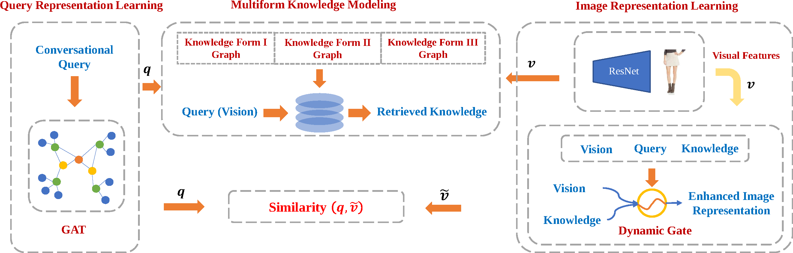

# LARCH

This is the official pytorch implementation of the paper: **Conversational Image Search.** Liqiang Nie, Fangkai Jiao, Wenjie Wang, Yinglong Wang, and Qi Tian. *Under review*.



### Abstract


>  Conversational image search, a revolutionary search mode, is able to interactively induce user response to clarify their intent step by step. Several efforts have been dedicated to the conversation part, namely asking the right question at the right time towards user preference elicitation, while few studies focus on the part of image search given the well-prepared conversational query. In this paper, we work towards this untapped task. Compared to the traditional image search task, this one is much challenging due to these facts: 1) understanding complex user intent from a multimodal conversational query; 2) utilizing the multiform knowledge associated with images; and 3) enhancing image representation with distilled knowledge. To address these problems, in this paper, we present a novel contextuaL imAge seaRch sCHeme (LARCH for short), comprised of three components. In the first component, we design a multimodal hierarchical graph-based neural network to learn the conversational query embedding, for better user intent understanding. As to the second one, we devise a multi-form knowledge embedding memory network to unify heterogeneous knowledge structures into a homogeneous base that greatly facilitates relevant knowledge retrieval. In the third component, we learn the knowledge-enhanced image representation via a novel gated neural network, which selects useful knowledge from the retrieved relevant one. Extensive experiments have shown that our LARCH yields significant performance based upon an extended benchmark dataset. As a side contribution, we have released the data, codes, and parameter settings to facilitate other researchers in the conversational image search community.


### Requirements

```bash
pip install -r requirements.txt
```

### To Reproduce the Results

#### Train

```bash
CUDA_VISIBLE_DEVICES=0 python main.py train_dgl
```
The hyper-parameters can be found in constants.py. Here are some details:
```python
DISABLE_STYLETIPS = False  # If `true`, the `style tips` knowledge is removed.
DISABLE_ATTRIBUTE = False  # If `true`, the `attribute` knowledge is removed.
DISABLE_CELEBRITY = False  # If `true`, the `celebrity` knowledge is removed.
IMAGE_ONLY = False  # If `true`, all forms of knowledge will be removed.

# Ablation study
KNOWLEDGE_TYPE = 'bi_g_wo_img'  # LARCH w/o vision-aware knowledge.
KNOWLEDGE_TYPE = 'bi_g_wo_que'  # LARCH w/o query-aware knowledge.
```

To train the model employing the multimodal hierarchical encoder (MHRED) as query encoder, use the following command:

```bash
CUDA_VISIBLE_DEVICES=0 python main.py train_text
```

#### Test

```bash
CUDA_VISIBLE_DEVICES=0 python main.py eval_graph
```

To evaluate the performance of LARCH w/o GRAPH, using the following command:
```bash
CUDA_VISIBLE_DEVICES=0 python main.py eval_text
```

You should change the path of saved checkpoint in evaluator to the path of the model to be evaluated.

Any question please contact: jiaofangkai@hotmail.com
